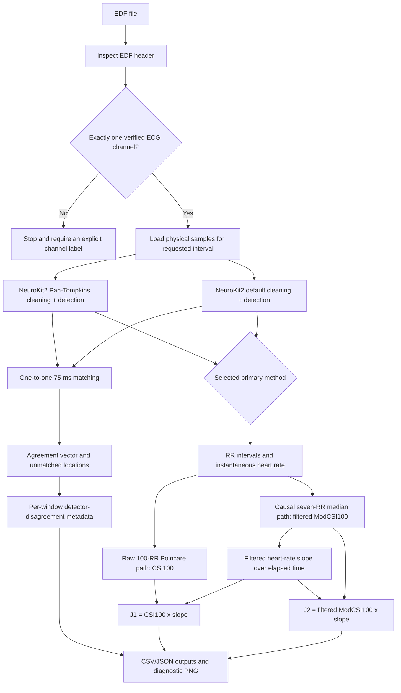

# 01. System architecture

## 1. Purpose

The package converts a selected interval of a single-lead EDF ECG into
auditable intermediate measurements. It deliberately stops before seizure
classification. This boundary allows each measurement layer to be tested
against the appropriate reference:

- EDF ingestion against header metadata and sample counts;
- R peaks against manual beat annotations;
- RR/HRV equations against synthetic numerical tests;
- seizure relevance against chronologically held-out annotated events.

Combining these validation questions into one model score would make it
impossible to determine whether a failure came from channel selection, peak
detection, feature extraction, signal artifact, or seizure classification.

## 2. End-to-end flow



## 3. Package layout

| Path | Responsibility |
|---|---|
| `src/ecg_cascade/__init__.py` | Defines the public package boundary. It currently re-exports only `run_rr_hrv_segment`; internal helper functions remain explicitly imported from their modules. |
| `src/ecg_cascade/edf.py` | EDF header inspection, channel selection, and physical-sample loading. |
| `src/ecg_cascade/peaks.py` | Detector execution and one-to-one agreement calculation. |
| `src/ecg_cascade/rr_hrv.py` | RR conversion, causal median filter, Poincare features, slope, and `J1`/`J2`. |
| `src/ecg_cascade/pipeline.py` | Calls modules in the correct order and records provenance. |
| `src/ecg_cascade/plotting.py` | Creates a noninteractive three-panel diagnostic plot. |
| `src/ecg_cascade/cli.py` | Parses commands, writes artifacts, and prints a run summary. |
| `tests/test_peaks.py` | Synthetic tests for matching and undefined empty inputs. |
| `tests/test_rr_hrv.py` | Synthetic tests for causality, Poincare values, slope, and 100-RR warm-up. |
| `config/datasets.toml` | Local recording paths, verified header labels, expected sampling rates, and event times. |

## 4. Data contracts between modules

### 4.1 EDF layer to peak layer

The EDF layer returns a `SignalSegment` containing:

- the resolved file path;
- immutable channel metadata;
- requested start time in seconds;
- actual loaded duration;
- a one-dimensional `float64` physical-sample array.

It does not normalize, filter, resample, or infer a different unit. Therefore
the peak layer receives the same physical scale returned by pyEDFlib.

### 4.2 Peak layer to RR/HRV layer

The peak layer provides:

- a sorted sample-index sequence for the chosen primary detector;
- the comparator sequence;
- matched sample pairs;
- primary-only and comparator-only samples;
- global agreement statistics.

The RR/HRV layer never silently merges the two sequences. The selected primary
sequence determines RR values; disagreement is carried as context.

### 4.3 RR/HRV layer to future fusion

The current output is a table, not a seizure probability. Each row represents
one interval ending at a primary R peak. Once 100 intervals are available, the
row may also contain `CSI100`, filtered `ModCSI100`, slope, `J1`, and `J2`.

Future fusion must preserve at least:

- measurement timestamp;
- measurement value;
- whether the equation was mathematically defined;
- whether the underlying 100-RR window contained detector disagreement;
- signal-quality context when that branch is implemented.

## 5. Time bases

The code uses three related coordinate systems.

### 5.1 Segment-relative sample index

Detector arrays contain integer samples counted from the beginning of the
loaded segment. Sample zero is the first sample returned by `readSignal`, not
necessarily the first sample in the EDF.

### 5.2 EDF-relative time

CSV `time_s` values are intended to represent seconds from the EDF start:

```text
time_s = segment_start_s + sample_in_segment / sampling_rate_hz
```

Event annotations supplied with `--event` use the same EDF-relative seconds.

### 5.3 EDF-relative sample index

`r_peak_sample_in_file` is reconstructed as rounded `time_s * fs`. At present,
`SignalSegment.start_s` stores the requested start time while pyEDFlib begins at
`round(start_s * fs)`. If a caller supplies a start time that is not exactly on
the sample grid, the reconstructed file sample can differ by approximately one
sample. Current test commands use integer-second starts, so this edge is not
triggered. A future revision should store the actual `start_sample` explicitly.

## 6. Causality

The RR/HRV operations are causal relative to the supplied interval:

- RR uses the current and immediately preceding primary R peak.
- The median-filtered RR at index `k` uses indices `k-6` through `k`.
- The 100-RR feature at index `i` uses `i-99` through `i`.
- No future event labels affect features.
- `--event` is passed only to the plotter for shading.

However, loading an arbitrary middle segment creates a **cold start**. The code
does not load the six RR intervals preceding the selected start. The first six
filtered intervals therefore use shorter histories, and the first 100-RR
feature window contains those startup values. Final full-record processing
should load preceding context or process continuously across chunk boundaries.

## 7. Reproducibility metadata

Each run stores:

- EDF path;
- complete selected-channel metadata;
- segment bounds;
- primary and comparator methods;
- 75 ms matching tolerance;
- 100-RR window size;
- seven-RR median width;
- the fact that threshold calibration was not applied;
- installed versions of NeuroKit2, NumPy, pandas, pyEDFlib, and SciPy.

This is necessary because two packages can expose algorithms with the same
historical name while differing in preprocessing, implementation, and returned
fiducial location.

## 8. Present safety boundary

The software currently permits finite features to be produced from uncertain
R peaks. This is deliberate for audit: it shows how errors propagate instead
of discarding them invisibly. Therefore:

```text
feature_defined == True
```

means only that both `J1` and `J2` were finite. It does **not** mean:

- the ECG was artifact-free;
- the peaks were correct;
- the RR intervals were physiological;
- the feature is safe for seizure inference.

Those decisions require separate validity fields and the future signal-quality
branch.
