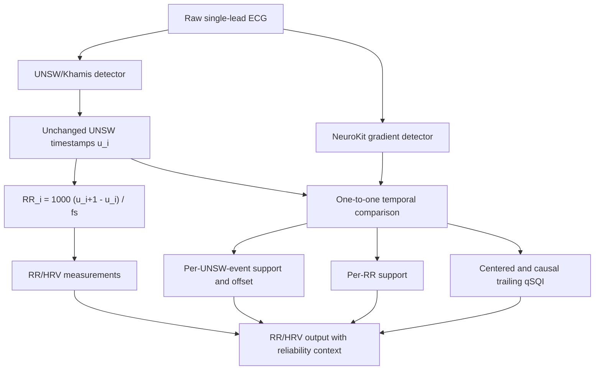

# UNSW-owned RR timestamps with NeuroKit reliability context

## Decision

This is the current **deployable baseline** for the RR/HRV branch:

- UNSW/Khamis is the only timestamp owner.
- Every RR interval is calculated from two unchanged UNSW events.
- NeuroKit is an independent detector-agreement measurement only.
- Detector agreement is retained as context; it is not an artifact label, a
  calibrated probability, or permission to delete a beat.

This choice is not the numerically lowest-error method in every comparison.
It is the safest current compromise because it preserves UNSW's high event
detection F1 and cannot introduce the large RR errors observed when timestamp
sources changed between adjacent beats.

## Implemented architecture

For consecutive UNSW samples `u[i]` and `u[i+1]`, the implementation uses

\[
RR_i=1000\frac{u_{i+1}-u_i}{f_s}.
\]

No NeuroKit sample appears in this equation.

For each UNSW event, the code counts NeuroKit events inside
\([u_i-w,u_i+w]\). The UNSW event is supported only when the count is exactly
one. It also retains the nearest detector offset

\[
\Delta_i=1000\frac{n_j-u_i}{f_s}.
\]

An RR interval is supported when both bounding UNSW events are uniquely
supported and the tolerance-expanded interval contains exactly two NeuroKit
events. This implements the primary/secondary structure described by Ho et
al.; it does not treat the secondary detector as ground truth.

The detector-agreement fraction is

\[
qSQI=\frac{2M}{N_{\mathrm{UNSW}}+N_{\mathrm{NK}}},
\]

where \(M\) is the number of monotone one-to-one matches. The formula is the
published qSQI/bSQI form. Applying it to this exact detector pair in centered
and causal trailing 10-second windows is an implementation adaptation, not a
literal replication of Zhao and Zhang's detector setup. The centered value is
for offline audit; the trailing value is causal.

## Evidence boundary

- Ho et al. used a primary detector to define RR and a secondary detector to
  support the bounding QRS events. They used a \(\pm150\)-ms matching rule and
  reported UNSW plus NeuroKit as the preferred pair when high RR coverage was
  required in their TELE dataset. They also warned that the result required
  validation on other data and arrhythmias.
- Zhao and Zhang published the agreement formula, but used different
  detectors and record-level quality categories. Their result does not make
  the present UNSW--NeuroKit qSQI a probability of correctness.
- Li, Mark, and Clifford used beat-detector agreement in local 10-second
  windows. The present trailing 10-second implementation is a causal
  adaptation.

Primary sources:

- Ho et al., 2024: https://cinc.org/archives/2024/pdf/CinC2024-084.pdf
- Zhao and Zhang, 2018: https://doi.org/10.3389/fphys.2018.00727
- Li, Mark, and Clifford, 2008: https://pmc.ncbi.nlm.nih.gov/articles/PMC2259026/

## All-48-record benchmark

The first channel of every MIT--BIH Arrhythmia record was evaluated against
the expert beat annotations. NeuroKit used the unmodified 300-ms strict
configuration. All RR errors below use unchanged UNSW intervals.

| Support tolerance | Supported RR coverage | All UNSW RR MAE | Supported RR MAE | Unsupported RR MAE | Interpretation |
|---:|---:|---:|---:|---:|---|
| 50 ms | 93.79% | 3.971 ms | **3.819 ms** | **6.433 ms** | Best descriptive separation |
| 75 ms | 95.87% | 3.971 ms | 3.953 ms | 4.425 ms | More coverage, weak separation |
| 100 ms | 95.95% | 3.971 ms | 3.963 ms | 4.169 ms | Little useful separation |
| 150 ms | 96.64% | 3.971 ms | **3.976 ms** | **3.802 ms** | Support is slightly worse than non-support |

The full-stream beat-detection result remains exactly the UNSW result at every
tolerance: TP 109,244, FP 350, FN 250, and F1 0.997261. This is a required
consequence of never changing the UNSW events.

At 50 ms, the supported subset retains 93.79% of RR intervals and reduces RR
MAE from 3.971 to 3.819 ms, a modest 3.8% reduction. The unsupported subset
has 6.433-ms MAE. This is useful enrichment, not proof that every supported
interval is correct.

The 150-ms result is an important negative finding. Although it gives the
highest coverage, supported intervals have slightly greater error than
unsupported intervals. The published Ho tolerance therefore cannot be copied
unchanged and assumed to be valid on MIT--BIH.

Choosing 50 ms from these same 48 records is development-set selection. It
must be frozen and retested on held-out patient data before being described as
validated.

## Five previously difficult records at 50 ms

| Record | Supported coverage | All UNSW RR MAE | Supported RR MAE | Unsupported RR MAE | Result |
|---:|---:|---:|---:|---:|---|
| 108 | 79.35% | 8.379 | **9.083** | 5.626 | Agreement selects a worse subset |
| 113 | 42.14% | 0.919 | 0.895 | 0.937 | Very small improvement, low coverage |
| 207 | 9.28% | 3.635 | **9.367** | 3.045 | Severe morphology-dependent failure |
| 222 | 69.36% | 5.433 | 5.277 | 5.789 | Modest improvement |
| 231 | 73.81% | 1.525 | 1.324 | 2.113 | Useful enrichment |

Records 108 and 207 disprove a universal interpretation of agreement as
accuracy. In record 207, the secondary detector agrees with only a small,
non-representative morphology subset; those supported intervals are actually
less accurate. Detector agreement therefore cannot be a hard accept/reject
gate.

## qSQI is context, not a probability

Across all evaluable intervals at 50 ms, the Spearman correlation between the
causal trailing qSQI and absolute RR error was only -0.152. The relationship
was also non-monotonic:

| Trailing qSQI | Evaluable intervals | RR MAE | Supported fraction |
|---:|---:|---:|---:|
| <0.80 | 5,477 | 5.007 ms | 20.23% |
| 0.80--<0.90 | 3,183 | 6.975 ms | 72.16% |
| 0.90--<0.95 | 5,429 | 7.376 ms | 86.04% |
| 0.95--<1.00 | 9,388 | 4.389 ms | 96.91% |
| 1.00 | 85,397 | 3.530 ms | 100% |

Perfect local agreement was associated with the lowest pooled error, but an
increase from 0.80 to 0.95 did not monotonically reduce error. Consequently,
values such as 0.90 must not be stated as “90% probability that the ECG is
correct” or “90% signal quality.”

## Comparison with the other tested timestamp strategies

| Method | Beat F1 | RR MAE | Critical trade-off |
|---|---:|---:|---|
| UNSW alone | 0.997261 | 3.971 ms | Highest current event-detection baseline; slower fiducial timing |
| **UNSW + NeuroKit context, full stream** | **0.997261** | **3.971 ms** | Same timestamps; adds context without changing errors |
| **UNSW + NeuroKit context, supported subset at 50 ms** | Not a new detector | **3.819 ms** | 93.79% coverage; support fails on some records |
| NeuroKit alone | 0.980334 | 3.307 ms | Lowest full-stream RR MAE, but materially lower F1 and severe record failures |
| Zhai reimplementation alone | 0.985637 | 3.832 ms | Template limitations and lower F1 |
| UNSW--NeuroKit--Zhai timestamp fusion | 0.997070 | 3.382 ms | Better pooled RR error, but 23.535-ms source-transition RR MAE and record deterioration |

The context architecture does not beat NeuroKit alone or timestamp fusion on
pooled RR MAE. It is preferred as the baseline because it avoids their larger
coverage and source-transition risks. Timestamp fusion remains an ablation or
challenger until patient-specific annotated validation shows that its gains
are stable.

## Output contract

Every interval retains:

- unchanged `rr_ms` and `heart_rate_bpm` from UNSW;
- support of both bounding UNSW events;
- NeuroKit match count and detector offset at each boundary;
- whether an extra NeuroKit event occurs in the expanded RR interval;
- a categorical reliability reason;
- offline centered and causal trailing qSQI;
- missingness rather than an invented correctness probability.

The implementation is in
`src/ecg_cascade/rr_reliability_context.py`. The reproducible all-record audit
is in `scripts/benchmark_unsw_neurokit_context.py`, and its complete tables and
plots are under `outputs/unsw_neurokit_context_all48_v1`.
